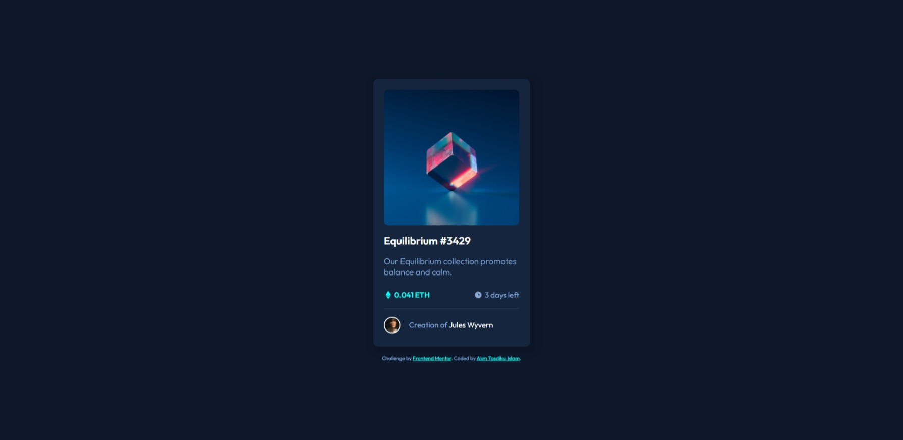
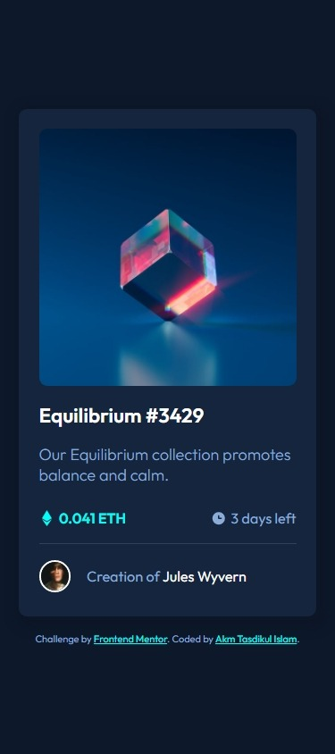

# Frontend Mentor - NFT preview card component solution

This is a solution to the [NFT preview card component challenge on Frontend Mentor](https://www.frontendmentor.io/challenges/nft-preview-card-component-SbdUL_w0U). Frontend Mentor challenges help you improve your coding skills by building realistic projects.

## Table of contents

- [Overview](#overview)
  - [The challenge](#the-challenge)
  - [Screenshot](#screenshot)
  - [Links](#links)
- [My process](#my-process)
  - [Built with](#built-with)
  - [What I learned](#what-i-learned)
- [Author](#author)

**Note: Delete this note and update the table of contents based on what sections you keep.**

## Overview

### The challenge

Users should be able to:

- View the optimal layout depending on their device's screen size
- See hover states for interactive elements

### Screenshot

<div 
  style="
    display:flex;
    align-items:flex-end;
    gap:5px; text-align:center;
    width:100%;
    height:auto;
">

<div
  sytle="
    display:flex;
    flex-direction:column;
    width:70%
"> Desktop View</div>
<div
  sytle="
    display:flex;
    flex-direction:column;
    width:30%
"> Mobile View</div>
</div>

### Links

- Solution URL: [Solution URL](https://github.com/akmtasdikulislam/nft-preview-card-component)
- Live Site URL: [Live site URL](https://akmtasdikulislam.github.io/nft-preview-card-component/)

## My process

- Step 1: Wrote down all the necessary markups
- Step 2: Added all necessary stylings

### Built with

- Semantic HTML5 markup
- CSS custom properties
- Flexbox

### What I learned

Positioning relative parent element and positioning absolute child element, keeps the child element within the parent element not within the entire document. But it behaves absolute inside the parent element that means it does not have any specific space allocated in its parent.

I've used used this concept for the image hover effect.

```css
.card-image {
  position: relative;
}

.card-image .hover-view {
  position: absolute;
}
```

## Author

- Website - [Akm Tasdikul Islam](http://www.tasdikul.rf.gd)
- Frontend Mentor - [@akmtasdikulislam](https://www.frontendmentor.io/profile/akmtasdikulislam)
- Twitter - [@Akm_Tasdikul](https://www.twitter.com/Akm_Tasdikul)
